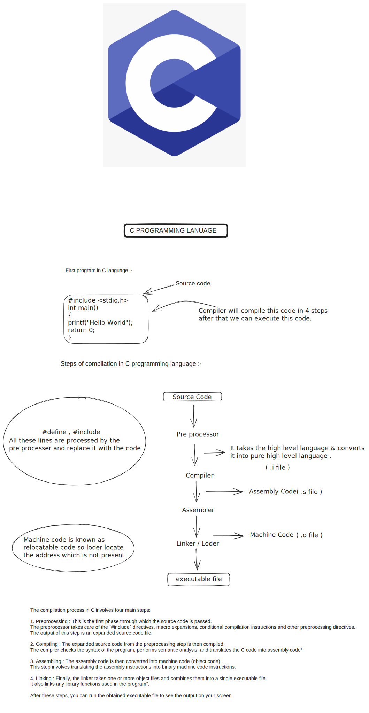

## C is a high-level programming language that was developed in the early 1970s by Dennis Ritchie at Bell Labs

## Features of c programming language

1. Procedural Language
2. Statically Typed
3. Low-Level Operations
4. Case-Sensitive

## Compilation of program in C language



##  Constants in C

### What are Constants?

Constants are **fixed values** that **do not change** during the execution of a program. Once defined, their value remains the same throughout the program.

### Types of Constants

1. **Integer Constants**  
   Example: `10`, `-25`, `0`

2. **Floating-point Constants**  
   Example: `3.14`, `-0.99`, `2.0e4`

3. **Character Constants**  
   A single character enclosed in single quotes.  
   Example: `'A'`, `'z'`, `'1'`

4. **String Constants**  
   A sequence of characters enclosed in double quotes.  
   Example: `"Hello World"`, `"123"`

5. **Symbolic Constants** (Defined using `#define`)
   ```c
   #define PI 3.14159
   ```

### Example of constant in c

```
const int MAX = 100;
```

##  Understanding Variables in C Language

### What is a Variable?

In C programming, a **variable** is a **named storage location** in the computer's memory that holds a value which can be modified during program execution. It is a fundamental concept that allows a programmer to store, retrieve, and manipulate data dynamically.

### Key Characteristics of Variables

1. **Name**: Identifier used to reference the memory location.
2. **Type**: Determines the kind of data the variable will store (e.g., `int`, `float`, `char`).
3. **Size**: The amount of memory allocated depends on the data type.
4. **Scope**: The portion of the program where the variable is accessible.
5. **Lifetime**: The duration for which the variable exists in memory.


### Syntax of Variable Declaration

```c
You can also assign an initial value at the time of declaration:

<datatype> <variable_name>;
```

### Example:

```c
int age;
float temperature = 36.5;
char grade = 'A';
```

### Types of Variables in C

1. **Local Variables**
   - Declared inside a function or block
   - Only accessible within that block
   - Not known outside the function

   Example:
   ```c
   void function() {
       int localVar = 5; // only accessible inside this function
   }
   ```

2. **Global Variables**
   - Declared outside all functions
   - Accessible by all functions in the file
   - Retains its value throughout the program

   Example:
   ```c
   int globalVar = 10;

   void function() {
       printf("%d", globalVar);
   }
   ```

3. **Static Variables**
   - Declared using the static keyword
   - Retains its value between function calls
   - Scope is local to the block, but lifetime is entire program

   Example:
   ```c
   void function() {
       static int count = 0;
       count++;
       printf("%d", count);
   }
   ```

### Rules for Naming Variables
• Must begin with a letter (A-Z or a-z) or an underscore _

• Cannot begin with a digit

• No special characters except _

• Cannot be a C keyword (e.g., int, return)

• Case-sensitive (score, Score, and SCORE are different)


## Identifiers in C

### What are Identifiers?

Identifiers are names used to identify variables, functions, arrays, etc. They are user-defined and must follow specific rules.

### Rules for Identifiers:
- Can contain letters (A–Z, a–z), digits (0–9), and underscore (_)
- Must begin with a letter or underscore (_), not a digit
- Cannot be the same as C keywords
- Are case-sensitive (Count and count are different)

### Examples:

➤ Valid Examples:
```c
total, _sum, value1, student_name
```
➤ Invalid Examples:
```c
1number  // starts with digit
int      // keyword
total$   // special character not allowed
```

## Keywords in C

### What are Keywords?

Keywords are reserved words in C that have special meaning to the compiler. They cannot be used as variable names.

### Common Keywords:

| Keyword | Meaning |
|---------|---------|
| int | Integer data type |
| float | Floating-point data type |
| char | Character data type |
| if, else | Conditional statements |
| for, while, do | Looping statements |
| return | Returns a value from a function |
| void | Indicates no return type |
| const | Declares constant variables |
| break, continue | Control flow statements |

*Note: There are 32 keywords in ANSI C.*

## Data Types in C

### What are Data Types?

Data types specify the type of data that a variable can hold. C is a strongly typed language, meaning you must declare the type of data.

### Basic Data Types:

| Type | Size (in bytes) | Format Specifier | Description |
|------|----------------|------------------|-------------|
| int | 2 or 4 | %d | Integer numbers |
| float | 4 | %f | Single-precision decimal |
| double | 8 | %lf | Double-precision decimal |
| char | 1 | %c | Single character |


### void:

Represents no value / no return type. 

```c

void displayMessage() {
    printf("Hello!");
}

```